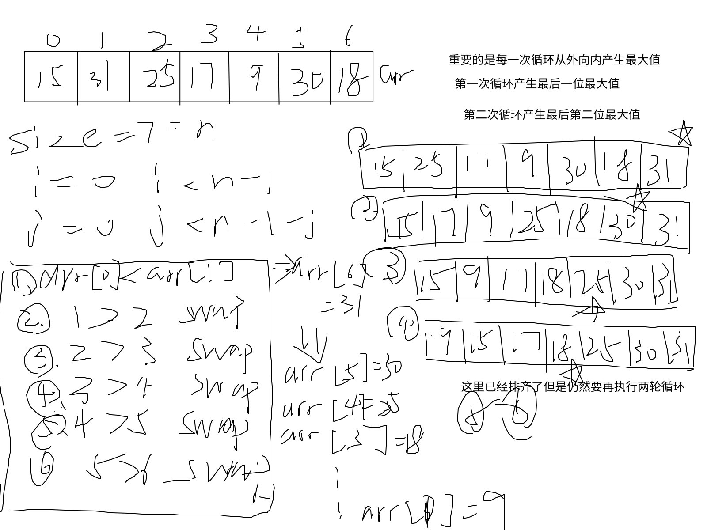

排序算法
---

# 冒泡排序(bubble_sort)

<a href="#bubble_sort" style="color: purple; text-decroation: none;"><strong>冒泡排序可视化</strong></a> 
原理：冒泡排序是一种简单的排序算法。它重复地遍历待排序的数列，一次比较两个元素，如果他们的**顺序错误**就把他们交换过来。遍历数列的工作是重复地进行直到没有再需要交换，也就是说该数列已经排序完成。这个算法的名字由来是因为越小的元素会经由交换慢慢“浮”到数列的顶端。

步骤:

   1. 从数组的第一个元素开始。
   2. 比较相邻的两个元素，如果第一个比第二个大，就交换他们两个。
   3. 对每一对相邻元素作同样的工作，从开始第一对到结尾的最后一对。这步做完后，最后的元素会
      是最大的数。
   4. 针对所有的元素重复以上的步骤，除了最后一个。
   5. 持续每次对越来越少的元素重复上面的步骤，直到没有任何一对数字需要比较。

~~~C
void bubble_sort(int arr[], int n)
{
  int i, j;
  for (i = 0; i < n - 1; i++)
  {
    for (j = 0; j < n - 1 - i; j++)
    {
      if (arr[j] > arr[j + 1])
      {
        int temp = arr[j];
        arr[j] = arr[j + 1];
        arr[j + 1] = temp;
      }
    }
  }
}
~~~

# 选择排序(selection_sort)

<a href="#selection_sort" style="color: brown; text-decroation: none;"><strong>选择排序可视化</strong></a> 
原理:
  选择排序是一种就地比较排序算法。它的时间复杂度为O(n2)，这使得它在大型列表上效率低下，并且通常比类似的插入排序表现更差。选择排序以其简单性而著称，并且在某些情况下，特别是在辅助内存有限的情况下，比更复杂的算法具有性能优势。

步骤:

   1. 查找最小值: 在数组的未排序部分中找到最小的元素。
   2. 交换: 将找到的最小元素与未排序部分的第一元素交换。
   3. 前进边界: 将已排序和未排序部分的边界向右移动一个元素。
   4. 重复: 重复该过程，直到整个数组都被排序。

~~~C
void selection_sort(int arr[], int n)
{
  int i, j, min_idx;
  for (i = 0; i < n - 1; i++)
  {
    min_idx = i;
    for (j = i + 1;j < n; j++)
    {
      if (arr[j] < arr[min_idx])
        min_idx = j;
    }
    int temp = arr[i];
    arr[i] = arr[min_idx];
    arr[min_idx] = temp;
  }
}
~~~

# 插入排序(insertion_sort)

<a href="#insertion_sort" style="color: yellowgreen; text-decroation: none;"><strong>插入排序可视化</strong></a> 
原理:
  插入排序是一种简单的排序算法，它一次一个地构建最终的排序数组。对于大型列表，它比快速排序、堆排序或归并排序等更高级的算法效率低得多。然而，它具有以下几个优点：实现简单，对于（相当）小的数据集有效，自适应（即，对于已经基本排序的数据集有效），并且稳定（即，不改变具有相等键的元素的相对顺序）。

步骤:

   1. 从数组的第二个元素开始。
   2. 将当前元素（键）与左侧已排序子数组中的元素进行比较。
   3. 将已排序子数组中所有大于键的元素向右移动一个位置。
   4. 将键插入到已排序子数组中的正确位置。
   5. 对数组中的所有元素重复此过程。

~~~C
void insertion_sort(int arr[], int n)
{
  int i, j, key;
  for (i = 1;i < n; i++)
  {
    key = arr[i];
    j = i - 1;
    
    while (j >= 0 && arr[j] > key)
    {
      arr[j + 1] = arr[j];
      j = j - 1;
    }
    arr[j + 1] = key;
  }
}
~~~

# 希尔排序(shell_sort)

原理:
  希尔排序是插入排序的一种更高效的改进版本。希尔排序是基于插入排序的以下两点性质而提出改进
  方法的：

   1. 插入排序在对几乎已经排好序的数据操作时，效率高，即可以达到线性排序的效率
   2. 但插入排序一般来说是低效的，因为插入排序每次只能将数据移动一位

  希尔排序通过允许交换相距很远的元素来改进插入排序。这个想法是安排数据序列在一个二维数组中
  ，然后使用插入排序对数组的列进行排序。该算法首先对相距很远的元素进行排序，然后逐渐减小要
  排序的元素之间的间隔。元素之间的间隔称为间隙。

  步骤:

   1. 从一个大的间隙开始: 从一个大的间隙开始，然后减小间隙。间隙序列可以以不同的方式选择。
一个常见的是Knuth序列(3*h + 1)，或者在每次迭代中简单地将数组大小减半(gap = n/2, gap = gap/2, ...)。
   2. h-sort 数组: 对于当前的间隙h，执行h-sort。一个h-sorted数组是h个交错的排序子序列。这是
      通过对相距h个位置的元素使用插入排序来完成的。
   3. 减小间隙: 减小间隙并重复h-sorting过程。
   4. 最后一步: 希尔排序的最后一步是普通的插入排序，但到这个时候，数组已经排得很好，这使得
      最后的插入排序非常有效。最后的间隙总是1。

<a id="bubble_sort"><strong>冒泡可视化</strong></a> 
 
<a id="selection_sort"><strong>选择可视化</strong></a> 
 
 

<a id="insertion_sort"><strong>插入可视化</strong></a> 
 
